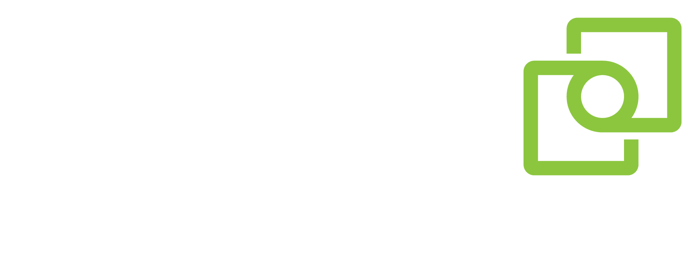
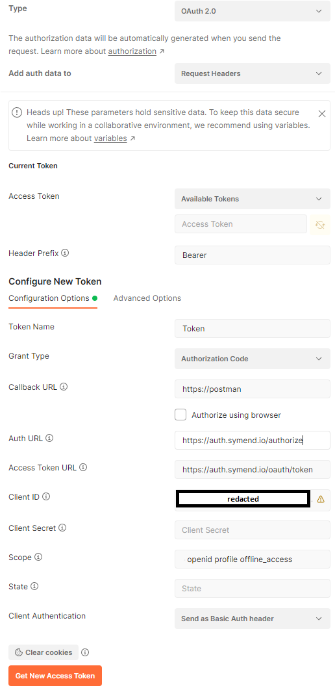
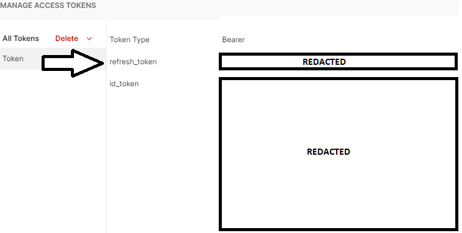

<a name="readme-top"></a>

<!-- PROJECT LOGO -->
<br />
<div align="center">
  <a href="https://symend.com/">
    
  </a>

  <h3 align="center">Symend Sample API Client</h3>

  <p align="center">
    Jumpstart your integration with Symend API services
  </p>
</div>

<!-- TABLE OF CONTENTS -->
<details>
  <summary>Table of Contents</summary>
  <ol>
    <li>
      <a href="#about-the-project">About The Project</a>
      <ul>
        <li><a href="#built-with">Built With</a></li>
      </ul>
    </li>
    <li>
      <a href="#getting-started">Getting Started</a>
      <ul>
        <li><a href="#prerequisites">Prerequisites</a></li>
        <li><a href="#environment-configuration">Environment Configuration</a></li>
      </ul>
    </li>
    <li><a href="#authentication-configuration">Authentication Configuration</a>
        <ul>
        <li><a href="#postman-configuration">Postman Configuration</a></li>
        </ul>
    </li>
    <li>
        <a href="#using-the-sample-client">Using the Sample Client</a>
        <ul>
            <li><a href="#appsettings">Appsettings</a>
            </li>
            <li><a href="#tenancy">Tenancy</a>
            </li>
        </ul>
    </li>
  </ol>
</details>

<!-- ABOUT THE PROJECT -->
## About The Project

The goal of this sample project is to demonstrate how to create a new Client against one of Symend's core APIs (Customer). It makes use of the OpenApi Code Generator to jumpstart client development and minimize boiler plate code required to start integrating with the Symend Solution.

The API Specification supplied represents a small subset of routes supported in our Customer API, that we find most useful when getting started during integration projects. For more comprehensive API documentation, please contact [support@symend.com](support@symend.com) or talk to your client service representative.
<p align="right">(<a href="#readme-top">back to top</a>)</p>
<!-- BUILT WITH -->

## Built With

* [DotNET6](https://dotnet.microsoft.com/en-us/download/dotnet/6.0)
* [OpenAPI Generator](https://openapi-generator.tech/docs/installation/)
<p align="right">(<a href="#readme-top">back to top</a>)</p>

<!-- GETTING STARTED -->
## Getting Started

To get started, please reach out to your Symend client representative to request a `ClientId`. This is required to authenticate your application, they will also provide guidance on 
scoping your service account user with the roles required to perform the tasks for your integration project.

### Prerequisites

This is an example of how to list things you need to use the software and how to install them.
1. [DotNET6](https://dotnet.microsoft.com/en-us/download/dotnet/6.0) or greater
    ```sh
   > dotnet --list-sdks
    6.0.305 [C:\Program Files\dotnet\sdk]
    ```

2. [openapi-generator](https://openapi-generator.tech/docs/installation/) is required to generate the latest version of the Customer API, it can be installed with NPM:
    ```sh
    npm install @openapitools/openapi-generator-cli -g
    ```

3. [Postman](https://www.postman.com/downloads/) or [Insomnia](https://insomnia.rest/) are API development/testing tools and are required to perform the Oauth2 login for you to recieve a `Refresh_Token` to keep your application authenticated. Note: In the next big release we will be supporting self-service API Key based auth, but if SSO is a requirement at your organization; using oAuth2 is a one time setup which is covered in the configuration section below.

### Environment Configuration

To get started, move to the root of the source directory and execute the commands below

1. Clone the repo
    ```sh
    git clone https://github.com/Symend-RyanMacDonald/CustomerIntegrationSample
    ```

2. Generate latest Customer API Client 
    ```sh
    openapi-generator-cli generate -i customer.v1.yaml -g csharp-netcore -o Symend.Client.Customer --additional-properties packageName=Symend.Client.Customer
    ```

## Authentication Configuration
To authorize API requests, you will need to login using your Symend Service account. This section goes over the Postman configuration, which will be similar in any other Oauth2 `Authorization_Code` grant type supporting clients.

### Postman Configuration

Open postman and create a new Collection, when the collection is selected, click on the `Authorization` option. The following screen should appear:

| Sample     | Setting      | Value     |
| ------------- | ------------- | -------- |
|          | <b>Type:<b/><br/><br/><b>Grant Type:</b><br/><br/><b>Callback URL:</b><br/><br/><b>Auth URL:<b/><br/><br/><b>Access Token URL: </b><br/><br/><b>Client ID:</b><br/><br/><b>Scope:</b>|`OAuth 2.0`<br/><br/>`Authorization Code`<br/><br/>`https://postman`<br/><br/>`https://auth.symend.io/authorize`<br/><br/>`https://auth.symend.io/oauth/token`<br/><br/>`Request from your Client Manager`<br/><br/>`openid profile offline_access`|

Click `Get New Access Token`, the following screen should look like this, you may need to scroll a bit to find your `refresh_token` value.

| Example Refresh Token Response     | | |
| ------------- | ------------- | -------- |
||||

Take note of the `refresh_token`, that is the only value we need. The `access` and `id` tokens are not required at this step, managing them will be automated inside the Sample application.

Note: The `refresh_token` you recieve here must be securely managed inside your deployment. To minimize complexity for our sample project we are storing this in the `appsettings.local.json` file but ideally for production deployments or docker/kubernetes deployments, this value should come from a secure Key Vault and injected as an Environment variable into your integration solution.

<p align="right">(<a href="#readme-top">back to top</a>)</p>

## Using the Sample Client
There are some hardcoded samples to demonstrate Creating new accounts using the base fields most clients need to enter somebody into a campaign. Note: Campaign configuration will vary for each organization so contact your internal Symend administrator to determine what Data Type Definition settings are correct for your project.

The sample project will run and exit once processing has completed. Depending on your use case, this could result in many requests back to the Symend Identitiy Provider to recieve new tokens for each execution cycle. To avoid this, its recommended to configure your application to run as a Background Worker service and have it run perpetually, responding to events in your system and re-using tokens from memory as efficiently as possible. If this is not viable / you are running a FaaS type solution, its recommended that you cache the token and `Refresh_Token` outside of the application securely in a distributed configuration or cache. This will reduce startup times and the potential for authorization request overuse.

### Appsettings

Copy the `appsettings.json` file and rename the copy to `appsettings.local.json` we don't want to share the `ClientId` and `RefreshToken` information. Using the `appsettings.local.json` and a the `.gitignore` settings for `appsettings.local.json` will ensure it is not mistakenly checked in to source control.
You can now edit the new `appsettings.local.json` file and replace the `AuthenticationConfig` values for `ClientId` and `RefreshToken` with the values you used in Postman.

Example:
```json
 "AuthenticationConfig": {
        "TokenExpiryGracePeriodSeconds": 60,
        "Authority": "https://auth.symend.io/oauth/token",
        "ClientId": "Client-Id-Here", // Replace with Client Id you received from your Symend client manager
        "RefreshToken": "Refresh-Token-Here" // Replace with Refresh_Token returned in Postman
    }
```

### Tenancy

In order to differentiate between organizations you may have access to, it is required that each request be accompanied with an organization ID. Organizations play a large part at Symend and help us determine where API calls are routed to ensure data residency requirements are met. Users are granted access to roles in the systen within the context of an Organization, so levels of access can vary between different organizations you may have been invited to.

The sample application will take care of supplying the organization values, we just need to inform the sample app of the organization ID we wish to use for our calls. We do that as follows:

In the Customer.Sample project, open the `program.cs` file and set your Organization Id Here:
```csharp
         //Start integration function here, supplying the OrganizationId for target Org 
        await app.Run("OrganizationId GUID here");
```

<p align="right">(<a href="#readme-top">back to top</a>)</p>

<!-- CONTACT -->
## Contact
Ryan MacDonald - [ryan.macdonald@symend.com](mailto:ryan.macdonald@symend.com)

Support - [support@symend.com](mailto:support@symend.com)

Project Link: [https://github.com/symend-deployments/symend-samples](https://github.com/symend-deployments/symend-samples)

#### Copyright
Copyright © 2020-2022 Symend Inc. - All Rights Reserved